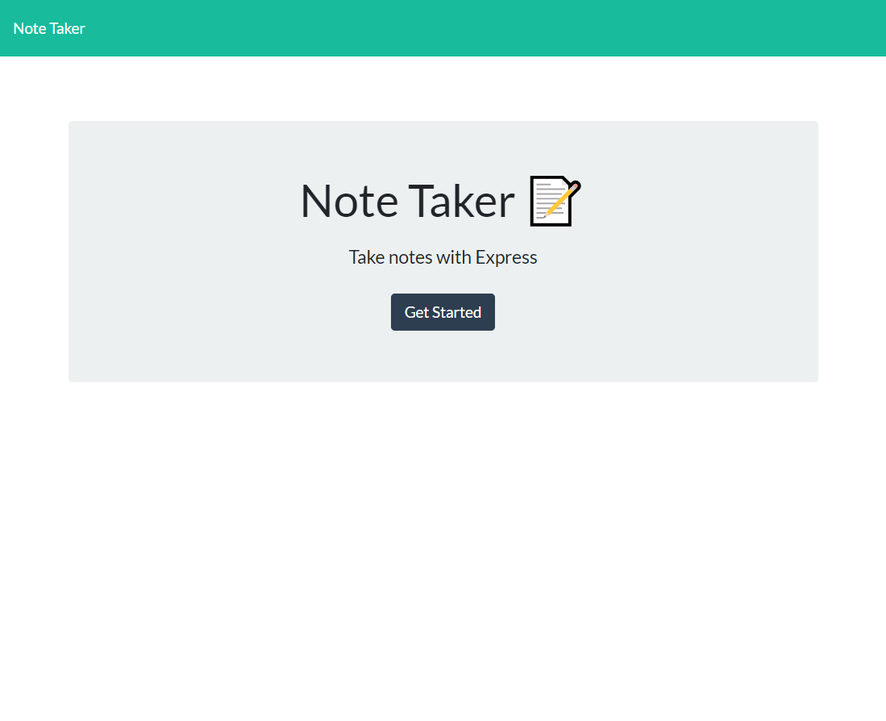

# Note Taker

## Description
This `Note Taker` application can be used to write and save notes, which helps organize and keep track of tasks that need to be completed. The assignment requires to build a back end using Express.js, connect it to the provided front end, and deploy the entire application using Heroku.

- When the `Note Taker` is opened, a landing page is presented with a link to a notes page. 
- Clicking on the link to the notes page will show a page with existing notes on the left side, and empty fields to enter a new note title and description on the right side. 
- After a new note title and text are entered, a Save icon appears on the top right. 
- Clicking on the Save icon saves the note and stores it in the left column. 
- If an existing note in the left column is clicked, it will appear on the right side. 
- To enter a new note title and text, click on the Write icon on top of the page, and enter the info in the right side column.

## Technologies
This application was created with CSS, HTML, JavaScript, Express.js, and Heroku.

## License
This project is licensed under the MIT license. Click the link below for more info.

[MIT License](https://opensource.org/licenses/MIT)

## Visuals
[Link to Note Taker](https://protected-waters-98594.herokuapp.com/)

